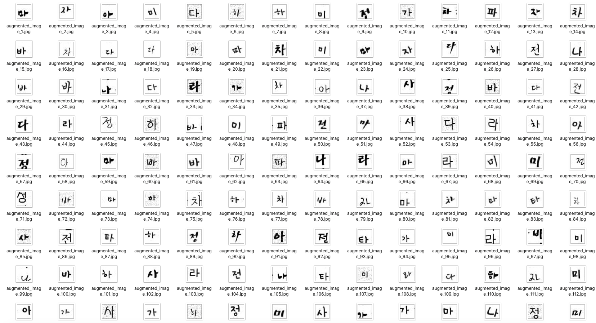
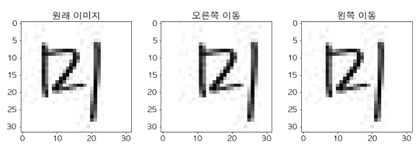
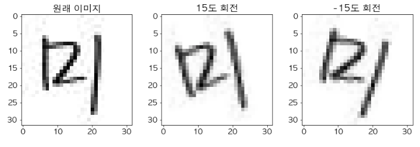
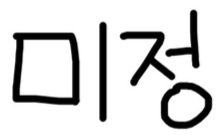
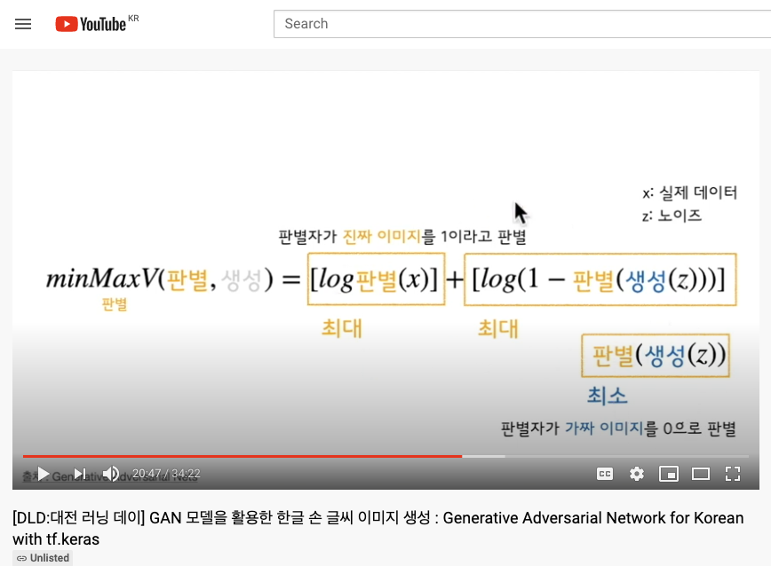

# 가나다라마-GAN Model 한글 손 글씨 이미지 생성
# Korean GAN : Generating Handwritten Korean Using Generative Adversarial Network (with tf.keras)


[](https://keras.io)


>  [iOS 모바일에서 한글 손글씨 인식하기(with Keras)](https://github.com/MijeongJeon/KoreanClassification_Keras_Coreml)와 이어지는 프로젝트로 더 많은 한글 데이터셋 구축을 위한 GAN 모델 활용에 관해 이야기합니다

**GAN 모델로 생성된 한글 손 글씨 🌱**


---

## Train Dataset


```
* Image Size: 32 X 32(pixel)
* Class Number : 16(가, 나, 다, 라, 마, 바, 아, 사, 자, 차, 타, 파, 하, 전, 미, 정) 
* Total Images : 9,962
```

- 직접 작성한 *미정 필기체*를 추가했습니다.
- 개인용 또는 상업용 사용이 가능한 46개의 한글 손글씨 폰트(*.ttf)을 이용해 데이터를 생성했습니다.
- TTF 파일을 이용해 이미지 데이터를 생성하는 방법은 [IBM Developer 사이트에 Paul Van Eck의 포스팅](https://developer.ibm.com/kr/journey/create-a-mobile-handwritten-hangul-translation-app)을 참고했습니다.

### Image Augmentation
- [scikit-image](https://scikit-image.org)를 활용해 상하좌우 이동, 회전된 이미지 추가로 데이터를 증폭했습니다

	```python
	from skimage.transform import rotate, AffineTransform, warp
		
	left_image = rotate(img, angle=15, cval=1)  
	right_image1 = rotate(img, angle=-15, cval=1) 
		
	hori_transform = AffineTransform(translation=(27,0))  
	warp_r_image = warp(img, hori_transform, mode="wrap")
		
	verti_transform = AffineTransform(translation=(0,27))  
	warp_l_image = warp(img, verti_transform, mode="wrap")
	```





> (English)  
- I created image data using 46 Korean handwriting fonts (* .ttf) that are available for personal or commercial use.  
- And I've added my own Mijeong Cursive.  
- For information on how to generate image data using TTF files, see [the article posted by Paul Van Eck on the IBM Developer site](https://developer.ibm.com/kr/journey/create-a-mobile-handwritten-hangul-translation-app/)  
- Used [scikit-image](https://scikit-image.org) to augment the image data by adding rotation and transformation.

## GAN with tf.keras 🤖
```
* Keras Version: 2.4.0  
* Backend: TensorFlow 2.3.0    
```
[GAN model training code in Jupyter Notebook](./KoreanGAN_GeneratingHandwrittenKoreanUsingGenerativeAdversarialNetwork.ipynb)

### GAN minMax Theory


`G: Generator, D: Discriminaror, x: real image, z: noise`

* Generator(생성자)의 역할
	*  진짜와 유사한 이미지를 생성해 판별자를 속인다 
* Discriminator(판별자)의 역할
	* 1. 진짜 이미지를 진짜라고 판별해야한다 (output ~ 1)
	* 2. 생성자가 만든 가짜 이미지를 보고 가짜라고 판별해야한다 (output ~ 0)

### Generator(생성자 모델)
* input으로 100개의 noise를 받아 (32*32*1) image를 생성한다
	
```python
def build_generator_model():
    model = tf.keras.Sequential() # Keras 모델 생성
	
    model.add(layers.Dense(1024, input_dim=100, use_bias=False))
    model.add(layers.BatchNormalization())
    model.add(layers.LeakyReLU())
    
    model.add(layers.Dense(8*8*128, use_bias=False))
    model.add(layers.BatchNormalization())
    model.add(layers.LeakyReLU())
    
    # Resahpe (8*8)
    model.add(layers.Reshape((8, 8, 128)))  
    
    model.add(layers.Conv2DTranspose(128, (5, 5), 
                                    strides=(1, 1), padding='same', use_bias=False))
    model.add(layers.BatchNormalization()) 
    model.add(layers.LeakyReLU())
    
    # (8*8) -> (16*16)
    model.add(layers.Conv2DTranspose(64, (5, 5), 
                                    strides=(2, 2), padding='same', use_bias=False))
    model.add(layers.BatchNormalization())
    model.add(layers.LeakyReLU())
    
    # (16*16) -> (32*32)
    model.add(layers.Conv2DTranspose(1, (5, 5), 
                                    strides=(2, 2), padding='same', activation='tanh'))
    assert model.output_shape == (None, 32, 32, 1)
	
    return model
```	

### Discriminator(판별자 모델)
* input으로 (32*32*1) image를 받아 0~1 사이의 output 값을 준다(이미지가 진짜라고 판별되면 1, 가짜라고 판별되면 0)

```python
def build_discriminator_model():

    model = tf.keras.Sequential()
    
    model.add(layers.Conv2D(64, (5, 5), strides=2, padding='same', 
                       input_shape=[32, 32, 1])) # input image size
    model.add(layers.LeakyReLU(0.2))
    model.add(layers.Dropout(0.3))

    model.add(layers.Conv2D(128, (5, 5), strides=2, padding='same'))
    model.add(layers.LeakyReLU(0.2))
    
    model.add(layers.Flatten())
    
    model.add(layers.Dense(256))
    model.add(layers.LeakyReLU(0.2))
    model.add(layers.Dropout(0.3))

    model.add(layers.Dense(1))
    
    return model
```

## Author 🤓 
  
Mijeong Jeon   
[ninevincentg@gmail.com](mailto:ninevincentg@gmail.com)


## 프로젝트 설명 영상으로 보기 🕊
[💻 Youtube 영상 보기](https://youtu.be/z-LIpUX-lpc)
[](https://youtu.be/z-LIpUX-lpc)
